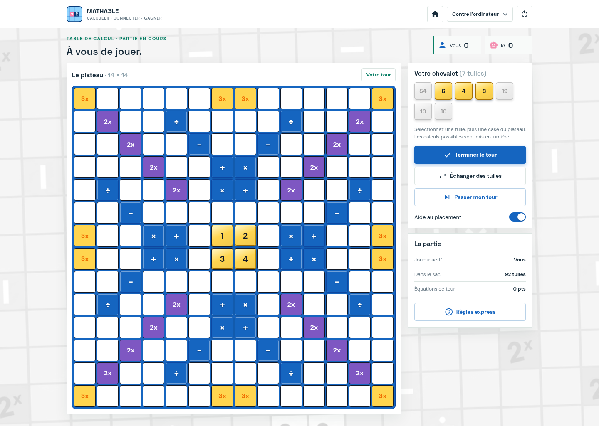
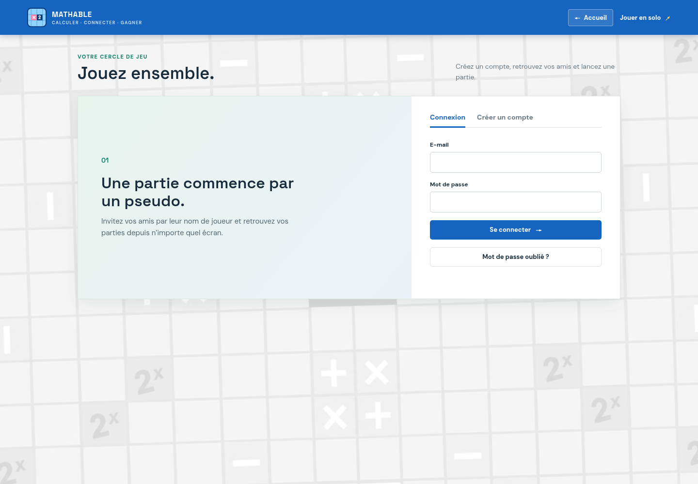

# Mathable Online
Projet Node.js/Express + Socket.IO + PostgreSQL, en français. Le moteur serveur partagé est dans `server/src/game/rules.js` et reprend le sac de 106 tuiles, le plateau 14×14 et les cases spéciales du fichier fourni.

## Captures et partage
Captures récentes de l’accueil, du jeu solo et de la page compte :

Afficher les captures d’écran

Les visuels de partage sont disponibles dans `public/share/` :

| Fichier | Dimensions | Usage conseillé |
| --- | --- | --- |
| `mathable-og.png` | 1200 × 630 | Open Graph, Facebook, LinkedIn, WhatsApp et messageries |
| `mathable-square.png` | 1080 × 1080 | Publications carrées et aperçus de profil |
| `mathable-story.png` | 1080 × 1920 | Stories et statuts verticaux |

Les quatre pages publiques déclarent les métadonnées Open Graph et Twitter et partagent le visuel `mathable-og.png`. Le favicon et le logo d’en-tête utilisent `public/mathable_logo.svg`; le fond du site vient de `public/mathable_back.png`.

## Installation
Copiez `.env.example` vers `.env`, configurez `DATABASE_URL` pour une base PostgreSQL locale, puis lancez `npm install`, `npm test` et `npm start`. Le serveur applique automatiquement la migration idempotente au démarrage. En développement sans SMTP, le code de vérification est écrit dans les logs du serveur.

Ouvrez `/account.html` pour créer un compte ou vous connecter. Les pseudos sont uniques; les comptes doivent être vérifiés par e-mail avant connexion. Ajoutez vos amis depuis leur pseudo, puis créez une invitation en mode tour par tour ou coups simultanés. Un joueur invité retrouve la partie depuis « Parties récentes » ou avec son code.

## Docker / VPS
`docker compose up -d --build`; copiez `.env.example` vers `.env` puis remplacez les valeurs de démonstration, en particulier `SESSION_SECRET` et `POSTGRES_PASSWORD`. Placez Nginx devant l'app, proxifiez `/socket.io/` avec `proxy_http_version 1.1`, `Upgrade` et `Connection`; activez HTTPS via Certbot/Let's Encrypt. Pour mettre à jour: sauvegarder PostgreSQL (`pg_dump`), `git pull`, `docker compose up -d --build`. Le volume `pgdata` conserve les données.

Variables Docker: `PORT`, `POSTGRES_USER`, `POSTGRES_PASSWORD`, `POSTGRES_DB`, `SESSION_SECRET`, `SMTP_HOST`, `SMTP_PORT`, `SMTP_USER`, `SMTP_PASSWORD`, `SMTP_FROM`. Compose transmet les paramètres PostgreSQL séparément pour prendre en charge les mots de passe contenant des caractères spéciaux. En local hors Docker, configurez `DATABASE_URL`. Sans SMTP en développement, le code de vérification est affiché dans l’interface.

## Fonctionnement des parties
Les coups en ligne sont validés par le serveur et réservés aux deux comptes invités. En tour par tour, seul le joueur actif peut poser des tuiles. En simultané, les deux chevalets peuvent jouer sans attendre; les coups concurrents sont validés et enregistrés l'un après l'autre.
